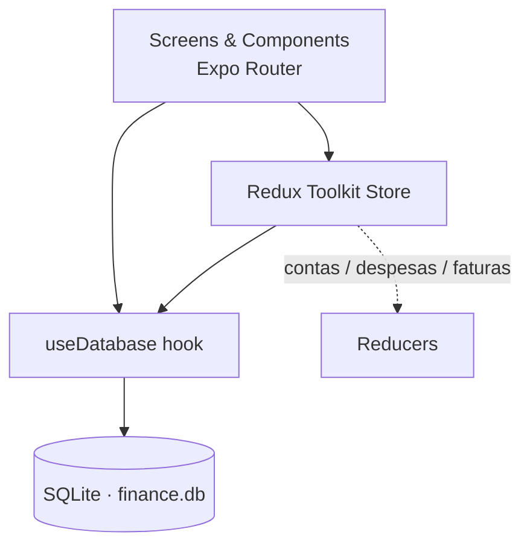

<h1 align="center">Finance Manager — Mobile</h1>

<p align="center">
  Cross-platform personal & business finance app — offline-first, with local persistence and rich data visualization.
</p>

<p align="center">
  
  
  
  
  
</p>

---

## Overview

**Finance Manager — Mobile** is the mobile tier of a three-platform financial-management product. It lets users track accounts, expenses and invoices, and visualize their financial position through interactive charts. The app works **offline-first**: data is persisted locally in SQLite and surfaced through a Redux store, so the UI stays fast and usable without connectivity.

Part of the same product family:

| Tier | Repository | Stack |
|------|-----------|-------|
| API | [`finance-api-quarkus`](https://github.com/renanbambam/finance-api-quarkus) | Java 21 · Quarkus · MongoDB |
| Web client | [`finance-manager-web`](https://github.com/renanbambam/finance-manager-web) | Angular 16 |
| **Mobile client (this repo)** | `finance-manager-mobile` | React Native · Expo |

---

## Features

- **Offline-first persistence** — local SQLite database (`finance.db`) accessed through a custom `useDatabase` hook.
- **Centralized state** — Redux Toolkit store split into `contas` (accounts), `despesas` (expenses) and `faturas` (invoices) slices.
- **Data visualization** — charts powered by `react-native-gifted-charts`, `svg-charts` and `d3` for income/expense breakdowns and trends.
- **Navigation** — Expo Router (file-based) with combined drawer + bottom-tab navigation.
- **Forms & validation** — `react-hook-form` with reusable modal components.
- **Theming** — light/dark support via themed components and a centralized color config.
- **Local notifications** — `expo-notifications` for reminders.

---

## Architecture



| Area | Path | Responsibility |
|------|------|----------------|
| Routing & screens | `app/` | File-based routes (Expo Router), tab layout |
| Reusable UI | `components/` | Themed views, modals, forms, headers, navigation |
| State | `src/redux/reducers/` | `contas`, `despesas`, `faturas` slices |
| Persistence | `hooks/useDataBase.ts` | SQLite schema bootstrap, queries, seeding |
| Config | `src/config/` | Theme colors and app constants |

---

## Getting started

### Prerequisites
- Node.js 18+
- Expo CLI (`npx expo`)
- Android Studio / Xcode for native emulators (optional — Expo Go works for quick runs)

### Install & run
```bash
npm install
npm start        # Expo dev server
```
Then launch a target:
```bash
npm run android  # Android emulator / device
npm run ios      # iOS simulator
npm run web      # Web build
```

### Quality
```bash
npm run lint     # Expo lint
npm test         # Jest (watch)
```

---

## Tech stack

`React Native 0.74` · `Expo 51` · `TypeScript` · `Expo Router` · `Redux Toolkit` · `expo-sqlite` · `react-hook-form` · `react-native-gifted-charts` / `d3` · `axios`

---

## Testing

```bash
npm run lint     # Expo lint
npm test         # Jest
```

Continuous integration runs lint and a type-check build on every push (GitHub Actions).

---

## Screenshots

<!-- Add real captures (emulator / device) to docs/screenshots/ and embed them here, e.g.:


-->

_Captures of the main screens are tracked in `docs/screenshots/`._

---

## Future Improvements

- Add automated component tests for the main screens.
- Synchronize the local SQLite store with the backend API.
- Publish a downloadable build (APK) through GitHub Releases.
